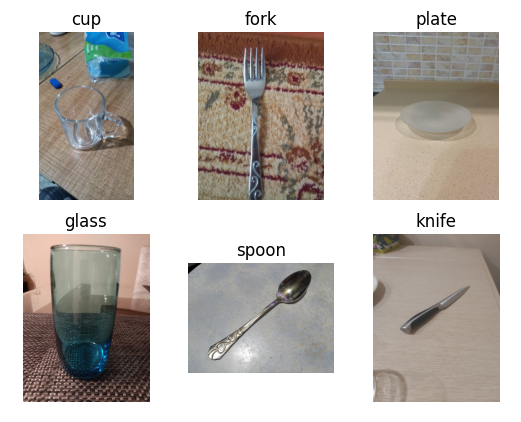
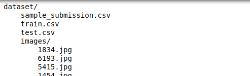

# Is it a Spoon? Knife? Plate?...: A ML Project Using Convolutional Neural Networks

In this project, we used Deep Learning to predict if an image is a spoon, knife, plate, cup, glass, or a fork.  
A total of 4445 images was used to train the model. The model's accuracy is around **95.5%**



This project was inspired by a [kaggle competition](https://www.kaggle.com/competitions/kitchenware-classification/overview) hosted by [Datatalks.Club](https://datatalks.club/).  

## Project Objective

In this competition we want to classify images of different kitchenware items into 6 classes/labels:

- cups
- glasses
- plates
- spoons
- forks
- knives

## Dataset

Download the image from the [kaggle competition](https://www.kaggle.com/competitions/kitchenware-classification/overview)

The dataset should consist of the following:

- Images
- train.csv - a csv file with the information on images to be used for the training the model. The fields included are Image ID and the class it belongs to
- test.csv - a csv file with the list of all the image ID to be used for the prediction
- sample_submission.csv - a csv file containing the template for submitting the prediction in the competition

Here's the sample directory for successful download of the data:  


## Data Preprocessing

To prepare the data for use in training a deep learning model, we will run the dataprep.py file which consists of the following:

- remove duplicate images
- sort the images into train and test
- further separate the train folder to train and validation sets (random shuffling with seed = 42)

## Training the Model

There are pre-trained Convolutional Neural Network available like [ImageNet](https://www.image-net.org/). However, to adjust the model based on our problem or goal, we will not use it fully.  
Instead, we will just use a part of the model which is the convolutional Layers. We are gonna train the rest of the model in this project ()

Base model. The one with the pre-trained convolutional layer of Imagenet

```python
base_model = Xception(weights='imagenet', include_top=False, input_shape=(299, 299, 3))
base_model.trainable = False
```

Final model. Adding a dense layer and a pool layer to be trained

```python
inputs = keras.Input(shape=(299, 299, 3))
base = base_model(inputs, training=False)
vectors = keras.layers.GlobalAveragePooling2D()(base)
outputs = keras.layers.Dense(<number of classes/labels>)(vectors)
model = keras.Model(inputs, outputs)
```

Note: Always check the parameter in the Dense layer `keras.layers.Dense(param)`. Always set it the number of classes we want to identify.

## Model Validation and Performance Tuning

Once our model is trained. we can further tune it with the help of `history` and `checkpointing`.  
Variables we can optimize:

- learning rate
- size of inner layers
- Regularization and dropout
- Augmentation

## Save the Model

Saving the model is important in order to make it accessible for consumption of users.

- Once we are finished with the training part, we can just select the best model output from the checkpointing we have done earlier  
(We can already delete the other `.h5` files)

```python
import tensorflow as tf
from tensorflow import keras

model = keras.models.load_model('<best_model>.h5')

tf.saved_model.save(model, 'converted_model')
```

- Run the command `saved_model_cli show --dir converted_model --all` to inspect the content of the tf model. Here's the example

```bash
signature_def['serving_default']:
  The given SavedModel SignatureDef contains the following input(s):
    inputs['input_35'] tensor_info:
        dtype: DT_FLOAT
        shape: (-1, 299, 299, 3)
        name: serving_default_input_35:0
  The given SavedModel SignatureDef contains the following output(s):
    outputs['dense_26'] tensor_info:
        dtype: DT_FLOAT
        shape: (-1, 6)
        name: StatefulPartitionedCall:0
  Method name is: tensorflow/serving/predict
```

Take note of the ff:

- inputs : in this case input_35
- outpus : in this case dense_26

## Deployment Strategies

In this project, we have tried 2 deployment frameworks:

1. Docker-Compose Deployment
2. Kubernetes on Local
3. Kubernetes on Cloud with AWS EKS

### Docker Deployment

Prerequisites:

- tf serving converted model and the inputs and outputs values
- dockerfile to be used to build the image for tf serving
- dockerfile to be used to build the image for gateway
- docker-compose.yaml file
- gateway.py
- test.py

1. Build the docker image for the tf serving model image

Dockerfile
```
FROM tensorflow/serving:2.7.0

COPY converted-model /models/converted_model/1
ENV MODEL_NAME="kitchenware-model"
```
Run Command in terminal
```
docker build \
	-t kitchenware-model:xception_v2 \
	-f image-model.dockerfile .
```

2. Build the docker image for the tf serving model image
Dockerfile
```
FROM python:3.8.12-slim

RUN pip install pipenv

WORKDIR /app

COPY ["Pipfile", "Pipfile.lock", "./"]

RUN pipenv install --system --deploy

COPY ["gateway.py", "proto.py", "./"]

EXPOSE 9696

ENTRYPOINT ["gunicorn", "--bind=0.0.0.0:9696", "gateway:app"]
```
Run Command in terminal
```
docker build \
	-t kitchenware-gateway:001 \
	-f image-gateway.dockerfile .
```

3. Once all the images are built, we can now run docker-compose `docker-compose up -d`
	* -d for detached mode.

4. Test the framework by running the test file

## Kubernetes Local

* Install kubectl and kind first
* Create a cluster
		`kind create cluster`
		
### Model Deployment & Service
*Model Deployment*
* Create a model-deployment.yaml
* Load docker image into cluster
		`kind load docker-image image-name`
* Apply the model deployment to our cluster:
		`kubectl apply -f model-delpoyment.yaml`
* (Optional) Test if the pod is working by:
	* forward the pod's port 
		`kubectl port-forward insert-pod-name 8500:8500`
	* run the local gateway script
		`python3 gateway.py`
*Model Deployment Service*
* Create a model-service.yaml
* Apply the model-service deployment to our cluster:
		`kubectl apply -f model-service.yaml`
* (Optional) Test if the service is working by:
	* forward the service's port 
		`kubectl port-forward insert-service-name 8500:8500`
	* run the local gateway script
		`python3 gateway.py`
		
### Gateway Deployment & Service
*Gateway Deployment*
* Create a gateway-deployment.yaml
* Load the docker image into the cluster
		`kind load docker-image image-name`
* Apply the gateway deployment to our cluster:
		`kubectl apply -f model-delpoyment.yaml`
* (Optional) Test if the pod is working by:
	* forward the pod's port 
		`kubectl port-forward insert-pod-name 9696:9696`
	* run the local gateway script
		`python3 test.py`
*Gateway Deployment Service*
* Create a gateway-service.yaml
* Apply the model-service deployment to our cluster:
		`kubectl apply -f gateway-service.yaml`
* (Optional) Test if the service is working by:
	* forward the service's port 
		`kubectl port-forward insert-service-name 9696:9696`
	* run the local gateway script
		`python3 test.py`

## Kubernetes AWS EKS
We will use eksctl to deploy our app in AWS EKS. But, before that, make sure that the following are configured properly:
* kubectl
* eksctl
	* command line tool for working with EKS clusters
	* installation link
* aws profile properly configured in the path

1. Create an eks-config.yaml
2. Publish docker images to ECR
3. Update the deployments and services yaml files
4. Apply the deployments and services to EKS
5. Change the url of the test.py file using the external-ip of the gateway service
		`kubectl get service`

If the cluster will not be used anymore, run the command below to avoid further charges
`eksctl delete cluster --name kitchenware-eks`